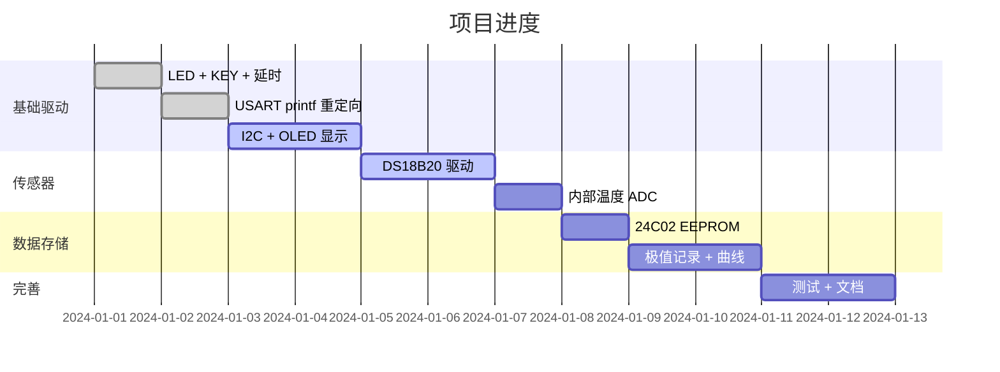

# 🌡️ MiniSTM32 桌面气象站

> 基于正点原子 MiniSTM32 V3.0 (STM32F103RCT6) 的桌面气象站项目  
> 开发环境: Keil MDK5 + STM32F10x 标准外设库  
> 适用对象: 集成电路/嵌入式专业大二学生

---

## 📸 项目简介

一个集温度采集、OLED 显示、串口上报、EEPROM 存储于一体的桌面气象站。从 GPIO 点灯到 I2C 通信，覆盖了 STM32 常用外设。

```
┌─────────────────────────────────────────┐
│              MiniSTM32 V3.0             │
│                                         │
│  DS18B20 ──→ PG11 (OneWire)            │
│  OLED    ──→ PB6/PB7 (I2C1)            │
│  EEPROM  ──→ PB6/PB7 (I2C1, 共用)      │
│  USB串口 ──→ PA9/PA10 (CH340G)         │
│  LED     ──→ PE5, PB5                  │
│  KEY     ──→ PE3, PE4, PA0             │
│                                         │
│  PC 端: 串口助手查看数据                │
└─────────────────────────────────────────┘
```

## 🎯 功能列表

- [x] DS18B20 数字温度传感器 (精度 0.0625°C)
- [x] MCU 内部温度传感器 (ADC1 通道16)
- [x] OLED 128×64 显示 (SSD1306, I2C)
- [x] 串口数据上报 (USART1, 115200bps)
- [x] 最高/最低温度记录 (AT24C02 EEPROM)
- [x] 温度趋势曲线 (简易版)
- [x] 按键切换显示模式
- [x] LED 心跳指示

## 📁 项目结构

```
MiniSTM32-WeatherStation/
├── README.md                   # 本文件
├── .gitignore                  # Git 忽略规则
├── User/
│   ├── main.c                  # 主程序
│   ├── main.h                  # 主程序头文件
│   ├── ds18b20.c/.h            # DS18B20 单总线驱动
│   ├── oled.c/.h               # OLED SSD1306 驱动
│   ├── oledfont.h              # ASCII 字库 (6x12 + 8x16)
│   └── 24c02.c/.h              # EEPROM 驱动
├── Hardware/
│   ├── LED/led.c/.h            # LED 驱动
│   ├── KEY/key.c/.h            # 按键驱动
│   └── DELAY/delay.c/.h        # 延时函数
└── docs/
    └── pinout.md               # 引脚分配表
```

## 🔧 硬件需求

| 模块           | 型号              | 接口    | 是否板载 |
|---------------|-------------------|---------|---------|
| 开发板         | MiniSTM32 V3.0    | —       | ✅      |
| 温度传感器     | DS18B20           | OneWire | 预留接口 |
| OLED 屏        | SSD1306 128×64    | I2C     | 需另购   |
| USB转串口      | CH340G            | USART1  | ✅ 板载 |
| EEPROM        | AT24C02 (256B)    | I2C     | ✅ 板载 |

**可选扩展:**
- DHT11/DHT22 温湿度传感器 (接任意 GPIO)
- 光敏电阻 + ADC 检测环境光
- 蜂鸣器温度报警

> ⚠️ 实际引脚分配请对照你的原理图 `docs/pinout.md`

## 🚀 快速开始

### 1. 克隆项目

```bash
git clone https://github.com/你的用户名/MiniSTM32-WeatherStation.git
```

### 2. 用 Keil 打开

1. 打开 Keil MDK5
2. Project → New uVision Project → 选择 `User/` 目录
3. 选择芯片: **STM32F103RC**
4. 添加所有 `.c` 文件到工程
5. 在 Options → C/C++ → Include Paths 添加：
   - `.\User`
   - `.\Hardware\LED`
   - `.\Hardware\KEY`
   - `.\Hardware\DELAY`
6. 在 Options → Target → 勾选 **Use MicroLIB** (printf 重定向)
7. 编译 → 下载 → 复位

### 3. 连接硬件

| 模块     | 开发板接口       |
|---------|-----------------|
| DS18B20 | DS18B20 接口 (PG11) |
| OLED    | PB6(SCL), PB7(SDA), 3.3V, GND |
| USB 线   | USB1 口 (CH340G) |

### 4. 查看输出

打开串口助手 (SSCOM/PuTTY/Arduino Serial Monitor):
- 波特率: **115200**
- 数据位: 8
- 停止位: 1
- 无校验

```
═══════════════════════════
  MiniSTM32 Weather Station
═══════════════════════════
  External Temp: 26.3 °C
  MCU Temp:      31.2 °C
  Max Record:    28.1 °C
  Min Record:    22.5 °C
  Tick:          42
═══════════════════════════
```

## 🎮 按键操作

| 按键    | 主界面          | 记录界面       | 曲线界面    |
|--------|----------------|---------------|-----------|
| KEY0   | 查看极值记录    | 返回主界面     | 返回主界面  |
| KEY1   | 查看温度曲线    | —             | 返回主界面  |
| WK_UP  | —              | 清除记录       | —         |

## 🔬 IC 知识扩展

本项目涉及的知识点与集成电路专业课的对应关系：

| 项目中的技术点               | 对应的课程知识                             |
|---------------------------|-----------------------------------------|
| DS18B20 bandgap 温度传感器  | **半导体物理**: 带隙基准、PN 结温度特性      |
| DS18B20 Σ-Δ ADC          | **数字IC**: ADC 架构、过采样、量化噪声       |
| OLED SSD1306 行列驱动      | **模拟IC**: MOSFET 开关阵列、显示驱动       |
| I2C 开漏输出 + 上拉电阻      | **电路分析**: 线与逻辑、噪声容限             |
| AT24C02 浮栅晶体管          | **半导体物理**: FN 隧穿、阈值电压偏移        |
| AMS1117 LDO 稳压           | **模拟IC**: 线性稳压器、反馈控制             |
| GPIO 推挽 vs 开漏           | **数字IC**: CMOS 反相器、驱动能力           |
| MCU 内部温度传感器 (BJT)     | **半导体物理**: BJT V_BE 温度系数          |
| 系统时钟 PLL               | **模拟IC**: 锁相环、VCO、分频器             |

> 💡 面试和考研复试中，能结合**课本理论 + 实际项目**回答问题是巨大的加分项。

## 📊 开发日志



## 🛠️ 常见问题

**Q: 编译报错 "Undefined symbol fputc"?**  
A: 在 Keil → Options → Target → 勾选 **Use MicroLIB**

**Q: 下载失败 "No Cortex-M SW Device Found"?**  
A: 检查 SWD 连接 (PA13/SWDIO, PA14/SWCLK) 和 BOOT0 跳线 (应接 GND)

**Q: DS18B20 一直读不到温度?**  
A: 检查 PG11 引脚连接，确认上拉电阻 (4.7kΩ) 已接；检查 `Delay_us()` 时序是否准确 (必须 72MHz)

**Q: OLED 不显示?**  
A: 检查 I2C 上拉电阻；确认设备地址 (0x3C)；用示波器检查 PB6/PB7 是否有波形

## 📝 License

MIT — 可以自由使用、修改、分发。

---

> 从点灯到气象站，每一步都值得记录。  
> 用 GitHub 积累，用 Claude 加速。 🚀
